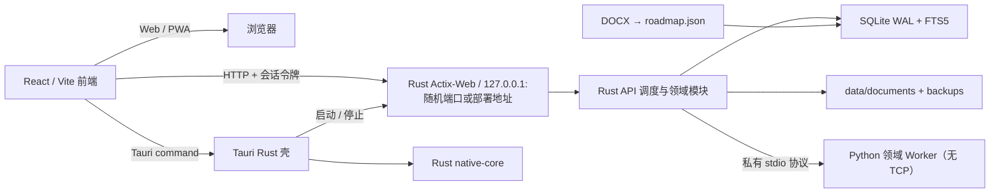

# 架构

## 进程职责

- Tauri Rust 壳：桌面窗口、文件选择器、剪贴板、随机可用端口、会话令牌、Actix-Web 本地 API 和应用退出。`native-core` 负责可测试的文件写入、哈希和后续归档任务。
- PlatformCapabilities：前端唯一的平台 interface；Web、Tauri Desktop/Tauri Mobile 通过各自 adapter 实现，业务页面不访问原生全局对象。
- React：工作台展示和用户交互；可作为 Web/PWA、Tauri Desktop 和 Tauri Mobile 前端构建，业务数据通过 API 获取，不直接读文件或 SQLite。
- Rust Actix-Web：桌面唯一 HTTP 入口，负责回环监听、公有会话校验、请求大小限制、生命周期与路由调度。未来 Rust 领域模块通过同一个 `RouteAdapter` seam 加入，不改变前端契约。
- Python 领域 Worker：迁移期保留 SQLite 领域服务、文档解析、AI 适配和 Python 运行器。它只通过受控 stdio 协议接收 Rust 调度，既不监听端口，也不向前端暴露令牌或 HTTP API。
- SQLite：业务唯一事实源；WAL、外键、约束、索引和 FTS5 触发器。

## 启动序列

1. Tauri 创建单实例桌面窗口并选择回环随机端口。
2. Rust 生成公有与私有高熵令牌，启动开发 `.venv` 或打包后的 Python 领域 Worker，并等待其 stdio 就绪信号。
3. Rust 启动 Actix-Web 回环 API；成功后通过 `runtime_config` command 将其 API 基址与公有令牌交给前端。
4. 前端经 `PlatformCapabilities` 创建统一 API 客户端，所有非健康检查请求附带会话令牌。
5. Web/PWA 使用构建时或页面注入的运行时配置，调用部署后的 Rust Host/服务；移动端不启动本地 Python Worker。
6. 退出时 Rust 先关闭 Actix-Web，再关闭 Python Worker；Python 运行器在 Worker lifespan 关闭时停止受管子进程。

## API 约定

成功响应使用 `{"ok": true, "data": ...}`；失败使用 `{"ok": false, "error": {"code", "message", "details"}}`。客户端对网络错误、超时和后端错误统一显示中文可恢复提示。

## 关键领域规则

- 知识先修边写入前执行有向环检测。
- 文档以课程内 SHA-256 去重，正文落 SQLite，原文件复制到受管目录。
- 掌握度使用 Beta 后验均值 `alpha / (alpha + beta)`；测验结果更新参数并安排复习。
- Python 每次运行使用独立工作目录与子进程，状态写入数据库。
- 备份以数据库快照为核心，ZIP 清单保存每个成员的 SHA-256；恢复前先备份当前状态。

