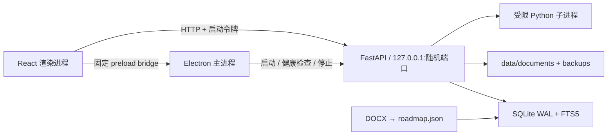

# 架构

## 进程职责

- Electron 主进程：单实例锁、窗口、文件选择器、剪贴板、随机可用端口、会话令牌、FastAPI 子进程和优雅退出。
- preload：只暴露运行时信息、窗口按钮、文件选择和剪贴板读取；不把 Node.js/Electron 任意能力交给页面。
- React：工作台展示和用户交互；业务数据通过 API 获取，不直接读文件或 SQLite。
- FastAPI：统一响应信封、校验、事务、领域规则、解析、检索、运行器和备份。
- SQLite：业务唯一事实源；WAL、外键、约束、索引和 FTS5 触发器。

## 启动序列

1. Electron 获取单实例锁并选择回环随机端口。
2. 生成一次性高熵令牌，启动 `.venv` 中的 Uvicorn。
3. 轮询健康端点；成功后创建隐藏窗口。
4. preload 向页面提供 API 基址与令牌，生产版从相对 `file://` 资源加载。
5. 页面完成首屏加载后显示窗口。
6. 关闭时先停止 Python 运行，再结束 Uvicorn，最后退出 Electron。

## API 约定

成功响应使用 `{"ok": true, "data": ...}`；失败使用 `{"ok": false, "error": {"code", "message", "details"}}`。客户端对网络错误、超时和后端错误统一显示中文可恢复提示。

## 关键领域规则

- 知识先修边写入前执行有向环检测。
- 文档以课程内 SHA-256 去重，正文落 SQLite，原文件复制到受管目录。
- 掌握度使用 Beta 后验均值 `alpha / (alpha + beta)`；测验结果更新参数并安排复习。
- Python 每次运行使用独立工作目录与子进程，状态写入数据库。
- 备份以数据库快照为核心，ZIP 清单保存每个成员的 SHA-256；恢复前先备份当前状态。

