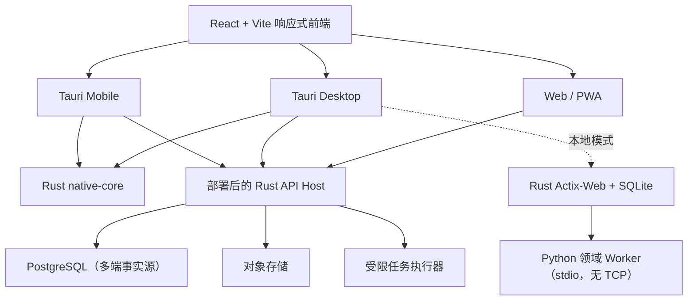

# Tauri 跨端与 Rust 优化计划

## 1. 目标与范围

将 StudyPilot Desk 从旧 Windows 桌面壳演进为同一套 React 前端可运行的产品：

- Web / PWA：现代浏览器直接使用；
- 桌面端：Tauri 2 打包 Windows、macOS、Linux；
- 移动端：Tauri 2 Mobile 打包 iOS、Android；
- Rust：承接原生壳、Actix-Web API 调度、系统权限和经过基准确认的重 I/O、文件处理任务；
- Python：迁移期继续承接学习领域规则、文档解析、智能体和现有领域实现，不再作为桌面 HTTP 服务。

本计划不承诺“所有功能离线且所有设备行为一致”。尤其本机 Python 运行器只适用于桌面本地模式；Web 与移动端必须通过受限的远程任务执行器获得等价能力。

## 2. 现状与架构决策

当前应用由 React/Vite、Rust Actix-Web、Python 领域模块、SQLite 与 Tauri/Rust 组成。前端通过 `PlatformCapabilities` 调用 Web 或 Tauri 能力，不直接读取原生全局对象。

目标架构如下：



### 已确认的技术栈

| 位置 | 选择 | 说明 |
|---|---|---|
| 桌面与移动壳 | Tauri 2（当前实现基线：v2.11.5） | 桌面使用系统 WebView，移动端使用 Tauri Mobile。 |
| UI | 保留 React 19、TypeScript、Vite | 当前 DOM/CSS、文档阅读器和 Mermaid 能最大化复用；先不改 React Native。 |
| 原生与本地 API | Rust stable、Actix-Web、官方 Tauri 插件 | Rust 位于 `src-tauri`、`local-host` 与共享 `native-core` crate。 |
| 领域适配 | Python / Pydantic（迁移期） | 保留领域规则和既有测试；通过私有 stdio adapter 逐步被 Rust 模块替换。 |
| 桌面本地数据（过渡） | SQLite WAL | 保持现有用户数据可打开，作为可选离线模式。 |
| 多端事实源（目标） | PostgreSQL + 对象存储 | 支持身份、同步、备份与多设备访问；文档原件不再保存在客户端数据库。 |
| 异步工作 | 持久队列 + 受限 worker，方案在试点确定 | 用于文档索引、导出、AI 与远程 Python；不能用进程内 BackgroundTask 代替可靠任务队列。 |

不在首期引入 Redux、微服务或 Rust 全量后端。它们会扩大 interface、降低迁移的 locality，且没有解决当前的跨端问题。

## 3. 关键模块与接口

### 3.1 平台能力模块

建立一个唯一的 `PlatformCapabilities` interface，前端业务只能依赖它，而不能读取 `window.studypilot`、Tauri 全局对象或浏览器特有对象。

接口的第一版仅包含：运行时配置、文件选择、保存导出、剪贴板、打开目录、窗口控制和截图。提供三个 adapter：

- `web`：File API、Clipboard API、Web Share / 下载；
- `tauri-desktop`：Tauri command 和最小权限插件；
- `tauri-mobile`：Tauri mobile plugin 与系统分享能力。

这是一个有明确变化来源的 seam：Web 与原生应用至少有两种 adapter。复杂的权限、路径、二进制数据转换应隐藏在 adapter 实现内。

### 3.2 Rust `native-core`

创建 Rust workspace，包含：

```text
src-tauri/                 Tauri 应用、权限清单和 command adapter
crates/native-core/        可测试的纯文件/归档/哈希能力
crates/local-host/         Actix-Web 本地 API、会话验证与 Python adapter
```

首批能力限定为：受管文件复制、SHA-256、原子写入、受限 ZIP 创建/校验、备份清单校验、临时目录清理和子进程生命周期监管。它们都是大文件 I/O 或系统操作，适合 Rust；PDF/DOCX/PPTX 的语义解析仍由已验证的 Python 库完成。

`native-core` 不接触课程或学习规则，也不直接拥有业务数据库。输入、输出、错误码和大小上限应形成小 interface，并同时由单元测试和 Python/Tauri 集成测试覆盖。

### 3.3 后端与运行模式

迁移期间存在两种运行模式：

1. **本地桌面模式**：Tauri 启动 Rust Actix-Web；SQLite 与 Python 工作台保持可用。Python 领域模块通过私有 stdio Worker 调用，不绑定端口。
2. **联网模式**：所有客户端调用部署后的 Rust API Host；PostgreSQL 是多端事实源，文档存入对象存储。

客户端只依赖 `RuntimeConfig` 提供的后端基址和能力集合，不自行判断端口、Worker 或部署环境。桌面私有 Worker 不能用于 iOS/Android，故移动端必须走联网模式。

## 4. 分阶段实施

### M0：基线与设计冻结

- 补全当前桌面端的冷启动、空闲内存、安装包体积、50 MB 文档导入、备份/恢复、首屏与 Python 运行指标。
- 记录当前 API 契约、SQLite schema v22、备份格式和数据恢复演练结果。
- 修复文档中的 schema 版本与运行数据库路径陈旧描述。
- 确定首发范围：联网模式是否必须登录、是否支持桌面本地模式、移动端是否包含 Python 工作台。

**退出条件**：有可复跑的性能采样脚本和一份兼容性清单；任何“优化”都能与基线比较。

### M1：前端平台抽象

- 引入 `PlatformCapabilities` 和 Web adapter；逐处替换 `window.studypilot` 直接调用。
- 将运行时配置迁至可注入的 `RuntimeConfig`。
- 把 `App.tsx` 拆为启动、课程、资料和语言 shell，减少根模块路由/状态/页面组合耦合。
- 在纯浏览器中启动应用，未支持的原生操作显示可恢复提示而非崩溃。
- 修正本地 API 会话令牌：除健康检查外统一验证，客户端统一附带令牌；为联网模式预留 Bearer access token adapter。

**退出条件**：Web 开发模式通过核心前端测试，且没有业务代码直接引用原生全局对象。

### M2：Tauri Desktop 最小替换

- 添加 `src-tauri`、Tauri 配置、最小 capabilities 与 CSP；只授权所需目录/插件。
- 用 Tauri 实现窗口、单实例、文件选择、导出、剪贴板、系统主题、打开目录与截图。
- 以 Actix-Web 承担随机回环端口、会话校验、健康检查、退出和错误日志采集；将已有 Python 领域实现封装为无 TCP 的 stdio Worker。
- 以 `native-core` 替换文件哈希与备份归档路径，保持备份格式兼容。
- 建立 Windows 桌面冒烟测试；随后验证 macOS/Linux 构建。

**退出条件**：Tauri Windows 包在现有数据目录上完成核心学习流、资料导入、导出、备份恢复和本地 Python 实验。

### M3：后端多端化

- 按课程、资料、知识、学习、语言、智能体和系统拆出 Rust route adapter；使 HTTP 调度层成为小的装配模块，并逐步以 Rust adapter 替换 Python adapter。
- 为认证、用户、设备和同步修订数据模型；定义课程/文档的所有权与共享模型。
- 将 SQLite 专属查询和 FTS5 实现移至存储 interface；实现 PostgreSQL adapter、迁移和回滚演练。
- 抽取对象存储 adapter，本地受管文件与 S3 兼容存储均可实现。
- 将长任务提交到持久队列；远程 Python 仅运行在隔离 worker，设置镜像、网络、CPU、内存、时长和输出限制。

**退出条件**：Web 和桌面联网模式可登录、同步同一课程，并可从现有 SQLite 导出/迁移而不丢失课程、文档、知识、复习和运行历史。

### M4：PWA 与 Tauri Mobile

- 加入 PWA manifest、离线壳、缓存策略和断网提示；不将未同步写入伪装为已持久化。
- 实现移动端文件导入、分享、下载、剪贴板、相机/相册（如产品范围需要）的 Tauri Mobile adapter。
- 为小屏重新设计导航、知识画布编辑和文档阅读；移动端首期不默认提供本地 Python 工作台。
- 在真实 iOS/Android 设备完成导入、学习、离线阅读、恢复联网和同步冲突测试。

**退出条件**：Web、Android、iOS 对同一账户的核心学习闭环可用；明确列出平台降级功能。

### M5：性能优化与旧桌面壳下线

- 根据 M0 基准验证 Rust 文件与归档模块是否达到目标；未证明收益的 Python 模块不重写。
- 实施前端路由级代码分割、长列表虚拟化、文档分块加载和取消机制。
- 审计 Tauri permissions、Python Worker 命令参数、文件路径、CSP、认证、备份和远程 worker 隔离。
- 从 CI、文档、依赖、打包和测试中删除旧桌面壳依赖。

**退出条件**：Tauri 在支持平台通过发布矩阵；数据迁移、回退、监控和支持文档齐备；无旧桌面壳生产依赖。

## 5. 测试与发布矩阵

每个里程碑都必须保持以下验证：

- Rust：`cargo fmt --check`、Clippy、`native-core` 单元测试、跨平台文件路径/归档测试。
- Frontend：Vitest、浏览器 E2E、键盘与小屏断点测试。
- Backend：pytest、SQLite 与 PostgreSQL 契约测试、迁移/回滚及备份恢复演练。
- Desktop：Tauri Windows 冒烟；macOS/Linux CI 构建和签名/公证准备。
- Mobile：Android emulator 与真实设备；iOS simulator 与真实设备，验证 WebView 差异。
- 兼容：旧 SQLite 备份导入、新旧桌面包升级、断网/恢复、重复上传与同步冲突。

发布采用金丝雀顺序：Web 预览环境 → Tauri Windows 内测 → Android 内测 → iOS TestFlight → 桌面正式发布。所有数据迁移必须先创建可验证恢复点。

## 6. 主要风险与处理

| 风险 | 处理 |
|---|---|
| 将 Python Worker 带到移动端 | 不做；移动端只调用已部署后端。 |
| SQLite FTS5 与 PostgreSQL 搜索语义不同 | 先定义搜索契约与回归语料，再实现 PostgreSQL 搜索；不要静默替换。 |
| Tauri 移动端插件/WebView 行为差异 | platform adapter 隔离，真机测试后逐项开放能力。 |
| Rust 重写没有性能收益 | M0/M5 基准为门槛；只迁纯 I/O、归档、哈希和明确 CPU 热点。 |
| 本地数据迁移造成损失 | 版本化导出、只增迁移、自动恢复点和人工演练。 |
| 远程 Python 成为安全风险 | 仅在隔离 worker 内运行；不继承密钥、不挂载宿主目录、默认禁止网络。 |

## 7. 首个实施迭代

首个实施迭代已完成前端平台抽象、Web adapter、运行时配置与 Tauri Desktop 骨架，并保持现有 React 页面、样式、FastAPI 业务与 SQLite 数据兼容。

## 8. 当前实施状态

- 已完成：`PlatformCapabilities` seam、Web/Tauri adapter、浏览器运行时配置、PWA manifest 与离线壳、Tauri/Rust workspace、`native-core` 原子写入与 SHA-256、桌面 Actix-Web 生命周期。
- 已完成：本地 API 的会话令牌在客户端统一附带，后端除健康检查外统一验证；已有前后端回归测试。
- 已完成：旧桌面壳源码、依赖、构建配置及旧 E2E 已移除；Tauri Rust release 可执行文件和 Python 领域 Worker 已在 Windows 构建。
- 已完成：移动端 adapter 不启动本地 Python；Android/iOS 构建时通过 `STUDYPILOT_MOBILE_API_BASE=https://api.example.com` 注入远程 API 基址，桌面端使用受会话令牌保护的 Actix-Web 回环 API。
- 后续前置：Android 初始化仍需 Android SDK/JDK；iOS 初始化需 macOS/Xcode。Windows NSIS 安装器需有权限下载并解压 Tauri 的 NSIS 工具。
